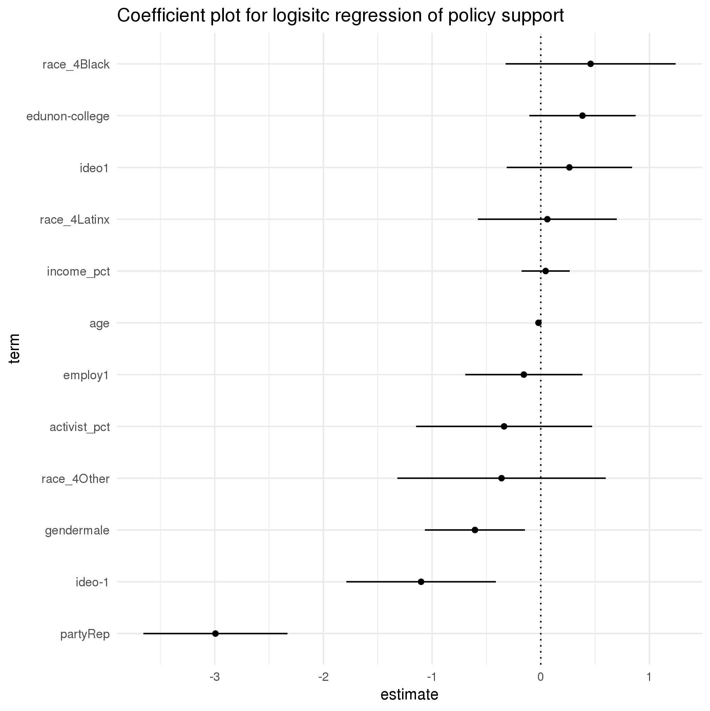

```{r setup, include=FALSE}

knitr::opts_chunk$set(echo = FALSE, message = FALSE, warning = FALSE,
                      fig.width = 8, fig.asp = 0.618, fig.align = "center")

library(tidyverse)
library(lubridate)

theme_set(theme_minimal())

test_data <- read_csv(here::here("data/test_data.csv"))
train_pred <- read_csv(here::here("output/train_predictions.csv"))

```

## Background

Voters in a particular jurisdiction are being asked to consider a ballot measure that would restrict women's access to healthcare. I was asked to use survey data to predict respondents

Among survey respondents, `r scales::percent(mean(test_data$target, na.rm = TRUE))` support the policy.

The chart below shows an output of a logistic regression estimating support for the measure. By far, party is the largest predictor of support or opposition; party along with gender and conservative ideology are the only statistically significant factors.



## Model performance

```{r}
calc_f1 <- function(cutoff) {
  
  train_pred %>% 
    mutate(
      cutoff = cutoff,
      label = if_else(pred > cutoff, 1, 0),
      tp = if_else(target == 1 & label == 1, 1, 0),
      tn = if_else(target == 0 & label == 0, 1, 0),
      fp = if_else(target == 0 & label == 1, 1, 0),
      fn = if_else(target == 1 & label == 0, 1, 0)
    ) %>% 
    group_by(cutoff) %>% 
    summarise(
      prec = sum(tp) / (sum(tp) + sum(fp)),
      recall = sum(tp) / (sum(tp) + sum(fn))
    ) %>% 
    mutate(f1 = 2 * ((prec *  recall) / (prec + recall))) %>% 
    ungroup()
  
}

cutoffs <- seq(0, 1, by = 0.02) %>% 
    map_dfr(calc_f1) 

max_f1 <- cutoffs %>% 
    filter(f1 == max(f1)) %>% 
    pull(cutoff)

cutoffs %>% 
    ggplot(aes(cutoff, f1)) +
        geom_line() +
        geom_vline(xintercept = max_f1, linetype = 3) +
        geom_text(aes(x = 0.125, y = 0.45, label = paste0('ideal cutoff: ', max_f1)))
```


## Turnout recommendations

### Establishing a cutoff

### Non-survey indicators for greater reach

It's possible that organizers will want to target a larger group of indviduals than just those for whom survey data is available. Because party is was the most influential predictor in determining opposition to the policy, I would recommend focusing on registered Democrats. The table below shows percent of registered Democrats who oppose the policy, broken down by race, education, and employment, indicators which may be available without the survey data. In these cases, white and Latino men, particularly college-educated white men, were the least likely to oppose the policy, but the policy receives relatively high levels of opposition among all women and men  of color.

```{r}

test_data %>%
    filter(!is.na(target), party == "Dem") %>%
    group_by(gender, race_4, edu, employ) %>%
    count(target) %>%
    filter(!is.na(race_4), !is.na(employ), !is.na(employ)) %>%
    mutate(pct = scales::percent(n / sum(n)),
           label = paste0(pct, " (", n, ")")) %>%
    ungroup() %>%
    mutate(
        employ = case_when(
            employ == 1 ~ "employed",
            employ == 0 ~ "unemployed"
        ),
        race_4 = fct_relevel(race_4, c("White", "Latinx", "Black")),
    ) %>%
    unite(` `, gender, edu, employ, sep = ", ") %>% 
    filter(target == 0) %>%
    select(-target, -n, -pct) %>% 
    spread(race_4, label, fill = "0%") %>%
    knitr::kable(caption = "Policy opposition by gender, educational attainment, employment, and race among Democrats")
```

Additionally, there appears to be a group of older, progressive Democrates who support the policy as shown in the chart below. It may be worthwhile to also consider age in any other turnout efforts. 

```{r}


test_data %>% 
    filter(!is.na(target)) %>% 
    mutate(
        party = fct_explicit_na(party),
        age = year(as.period(interval(ymd(paste0(birth_year, "0101")), today()))),
        ideo = case_when(
            ideo == 1 ~ "progressive",
            ideo == 0 ~ "moderate",
            ideo == -1 ~ "conservative"
        ),
        target = case_when(
            target == 1 ~ "support",
            target == 0 ~ "oppose"
        )
    ) %>% 
    ggplot(aes(age, fill = party)) +
    geom_histogram(binwidth = 5) +
    facet_grid(target ~ ideo) +
    scale_fill_manual(values = c("blue", "red", "dark grey")) +
    labs(title = "Policy support / opposition by party, ideology, and age")
```

