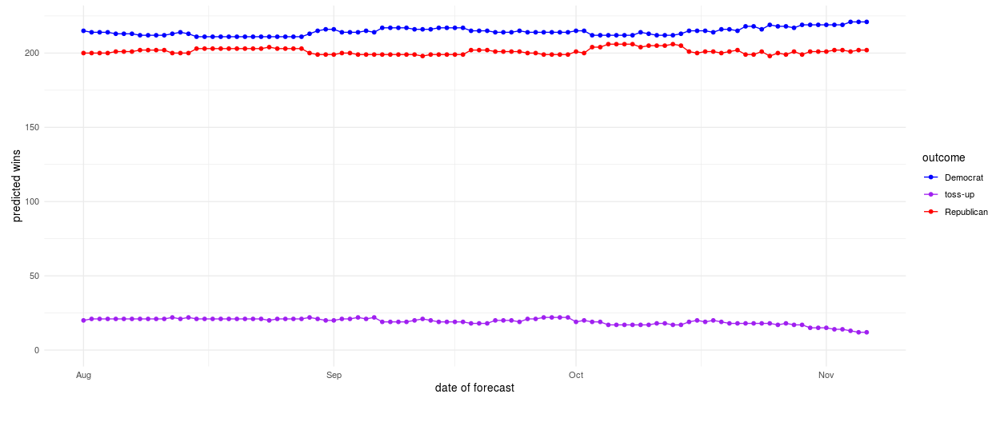

```{r setup, include=FALSE}

knitr::opts_chunk$set(echo = TRUE, eval = FALSE)

library(tidyverse)


voteshare <- readr::read_csv("data/voteshare.csv")
candidate <- readr::read_csv("data/candidate.csv")

```

All code for this submission can be found [here](https://github.com/jtcies/tmc-task).

## Task 1: SQL

```{python}

## I used the sqlite python api to test each query

import pandas
from sqlalchemy import create_engine

engine = create_engine('sqlite://', echo=False)
conn = engine.raw_connection()

voteshare = pandas.read_csv("data/voteshare.csv")

candidate = pandas.read_csv("data/candidate.csv")
                
voteshare.to_sql('voteshare', conn, if_exists='replace', index=False)
candidate.to_sql("candidate", conn, if_exists='replace', index=False)


```

**Question 1: Produce the rows with the five highest win probability.**

```{python}

q1 = pandas.read_sql_query("SELECT * FROM voteshare ORDER BY win_probability DESC, voteshare DESC LIMIT 5", 
                           conn)

q1

```

```
SELECT * 

FROM tmc.voteshare 

ORDER BY win_probability DESC, voteshare DESC 

LIMIT 5

```
<br>

**Question 2: How many unique forecast dates are included in this data set? What is the earliest forecast? Latest forecast?**

```{python}

q2a = pandas.read_sql_query('''SELECT count(DISTINCT forecastdate) as unique_dates
                               FROM voteshare''', conn)
                  
q2a

```

```

SELECT COUNT(DISTINCT forecastdate) as unique_dates

FROM tmc.voteshare
                               
```

```{python}

q2b = pandas.read_sql_query('''SELECT *
                  from (SELECT forecastdate 
                      from voteshare 
                      ORDER BY forecastdate
                      LIMIT 1) as first_date
                  
                  UNION 
                  
                  SELECT *
                  from (SELECT forecastdate 
                        from voteshare 
                        ORDER BY forecastdate DESC
                        LIMIT 1) as last_date''', conn)
                  
q2b

```

```
SELECT *

FROM (SELECT forecastdate 
      FROM tmc.voteshare 
      ORDER BY forecastdate
      LIMIT 1) as first_date
                  
UNION 
                  
SELECT *

FROM (SELECT forecastdate 
      FROM tmc.voteshare 
      ORDER BY forecastdate DESC
      LIMIT 1) as last_date

```

<br>

**Question 3: What was the average win probability for the November 6th forecast? Just for Democrats? Just for Republicans?**


```{python}


q3 = pandas.read_sql_query('''
SELECT 'all' as forecast_type,
      AVG(win_probability) as avg_win_prob
FROM voteshare
WHERE forecastdate = '2018-11-06'

UNION 

SELECT 'Republican' as forecast_type,
      AVG(win_probability) as avg_win_prob
FROM voteshare
WHERE forecastdate = '2018-11-06'
  AND party = 'R'

UNION 

SELECT 'Democrat' as forecast_type,
      AVG(win_probability) as avg_win_prob
FROM voteshare
WHERE forecastdate = '2018-11-06'
  AND party = 'D'
''', conn
)

q3

```


```
SELECT 'all' as forecast_type,
      AVG(win_probability) as avg_win_prob

FROM tmc.voteshare

WHERE forecastdate = '2018-11-06'

UNION 

SELECT 'Republican' as forecast_type,
        AVG(win_probability) as avg_win_prob

FROM tmc.voteshare

WHERE forecastdate = '2018-11-06'
  AND party = 'R'

UNION 

SELECT 'Democrat' as forecast_type,
        AVG(win_probability) as avg_win_prob
        
FROM tmc.voteshare

WHERE forecastdate = '2018-11-06'
  AND party = 'D'

```

<br>

**Question 4: What is the average win probability for the November 6th forecast for incumbents vs non-incumbents? This will require a join to the candidates table.**

```{python}


q4 = pandas.read_sql_query('''

SELECT AVG(voteshare.win_probability) as avg_win_prob,
       candidate.incumbent as incumbent

FROM voteshare
INNER JOIN candidate on voteshare.state = candidate.state 
  AND voteshare.party = candidate.party
  AND voteshare.district = candidate.district

WHERE voteshare.forecastdate = '2018-11-06'

GROUP BY candidate.incumbent


''', conn
)

q4

```

```

SELECT AVG(voteshare.win_probability) as avg_win_prob,
       candidate.incumbent as incumbent

FROM tmc.voteshare as voteshare
INNER JOIN tmc.candidate as candidate 
  ON voteshare.state = candidate.state 
  AND voteshare.party = candidate.party
  AND voteshare.district = candidate.district

WHERE voteshare.forecastdate = '2018-11-06'

GROUP BY candidate.incumbent

```

<br>

## Task 2: Explanatory Email

**Question 1: Volunteers were told that they would be speaking with pro-choice voters, or in other words, they would be speaking with voters that were modeled to be pro-choice. One volunteer remarked that she came across a number of voters who were not in favor of reproductive rights. Write a sample email that field organizers can use to help explain why this might happen when using model scores.**

There's a quote in statistics that says "All models are wrong but some are useful." We can never perfectly predict someone's beliefs, and we probably shouldn't try to. This model is just a tool to help drive resources to the correct location.

The type of model used to create these scores is a classification model. The output of a classification model is really just a probability, in this case the likelihood that someone will be pro-choice. 

When someone wants to make decisions from a model, like which houses to canvas, they have to set a reasonable cutoff for the score that is used to classify someone into a particular group. If they set the cutoff too high, they will have very few people in the group who shouldn't be, but they'll miss a lot of people who should be in that group. Set it too low, they'll get the opposite: lot's of people who should be in the group are not, but they won't miss many people who should be. So whoever is setting the cutoff has to decide which is a better. In either case though, the model will still misclassify people some of the time. 

From my experience canvassing, I think there may be opportunity to engage in dialogue with these individuals. Conversation around these issues may lead to learning for both the volunteer and the constituent. Additionally, they were rated as likely having pro-choice beliefs for a reason. If the volunteer listens and offers their authentic perspective, it may help to push the constituents thinking on the subject. 

<br>

## Task 4: Dashboarding

I created a Shiny application that can be accessed [here](https://jtcies.shinyapps.io/tmc-dashboard).

When creating this dashboard, I tried to think about what might be useful to member organizations, what problems they might be trying to solve, or what questions they might have. I built the dashboard around the following questions:

- How close is each party to winning a majority in the house? How certain is it that one party will take control?
- What are the districts that are in play? Where might a resource investment have a substantial impact? 
- What impact has resource investment had on electoral outcomes? 

The dashboard has three main visualizations Each of the charts can be filtered by the inputs on the left-hand side. 

### Inputs


- Party Turnout[^1]: This slider changes the voteshare used to predict outcomes. Move the slider right to show outcomes with a higher Democratic turnout, left for a higher Republican turnout. This allows the user to understand the range of potential outcomes and which districts are competitive.
- State: Each of the charts can be filtered to look at predictions for each state. 
- District: Each of the charts can be filtered to look at predictions for a specific district. 
- Date: Filter the charts to show predictions on a specific day. 
- Number of close races to show: Used to change the number of districts shows on the final chart (close races). 

### Visualizations

#### Predicted seats won


This shows the number of seats each party is predicted to win, as well as 'toss-up' races (those in which none of the candidates is predicted to receive greater than 50% of the vote).

#### Predicted wins over time



This shows the change over time in the number of seats each party is predicted to win, as well as 'toss-ups'. Note that is a state or district is chosen, this changes from a line chart to an area chart. 

#### Closest races


This shows the closest races as defined by the difference between the predicted Republican and Democratic voteshare. The number of races shown can be changed by the 'Number of close races to show' input. 

### Next steps

- While the slider shows the range of possible outcomes, it may not clearly communicate the probability of each of those outcomes. I'd like to find a way to more clearly demonstrate the probability of a 99th percentile outcome compared to a 50th percentile outcome. 

- Because the candidate data has more than one candidate per party in some districts, merging in the candidate data skewed the results. I would like to add candidate information to the plot, such as incumbency, but need to spend more time cleaning the candidate data. 

<br>

[^1]: To adjust party turnout, I created a continuous distribution of outcomes for each district. To do this, I calculated the standard deviation for each district by subtracting the mean and 90th percentile voteshare and dividing by 1.28 (the z-score at the 90th percentile). The slider changes the probability input to the quantile function of the normal distribution, using the mean and standard deviation for each district. The Democrat and Republican quantiles are inversely proportional: moving the slider to the right increase the probability for Democrats and decreases it for Republicans. Voteshares for independent candidates do not update based on this slider.